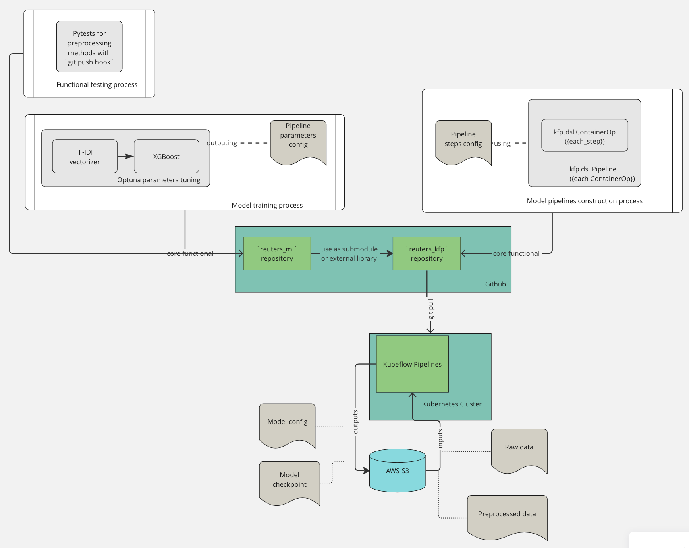

# Scalable Machine Learning System for Hierarchical Multi-Label Text Classification based on Reuters dataset

## Dataset
[The dataset](https://archive.ics.uci.edu/ml/datasets/reuters-21578+text+categorization+collection) used represents a collection of assembled and categorized news articles by Reuters Ltd. The provided link refers to the data formatted using the SGML Markup Language. However, the more proper format for the needed data is additionally presented via the [Hugging Face](https://huggingface.co/datasets/reuters21578/viewer/ModLewis/train) or [NLTK library](https://www.nltk.org/book/ch02.html).

## Task
### Objective
Design a scalable, maintainable, and efficient machine learning system that handles hierarchical multi-label text classification for a growing dataset of news articles. The system should utilize cloud-based resources, support MLOps practices, and provide an API for integration with other applications.

### Deliverables
1. A detailed system design document that includes architectural decisions, components, data flow, and rationale for design choices.
2. Visual diagrams and illustrations to support the system design.

## Experiments
| Architecture                 | F1-samples | Precision-samples | Recall-samples |
|------------------------------|------------|-------------------|----------------|
| preproc+ TF-IDF + KNN        | 38.73%     | 38.9%             | 38.8%          |
| TF-IDF + KNN                 | 79.36%     | 80.68%            | 79.8%          |
| preproc + TF-IDF + LinearSVC | 85.96%     | 87.65%            | 85.84%         |
| TF-IDF + LinearSVC           | 86.3%      | 87.99%            | 86.16%         |
| TF-IDF + Catboost            | 83.27%     | 84.67%            | 83.25%         |
| TF-IDF + XGBoost             | 87.1%      | 88.14%            | 87.7%          |

Conducted experiments have shown that the best F1-samples result leads to `TF-IDF + XGBoost`. 
This model will further be used in the service development.

## How to use
### Requirements
```bash
python 3.9
Docker
```
### Installation for developers
1. Clone current repository via `git clone`
2. Create virtual environment and install all requirements
```bash
cd reuters_ml
python -m venv env
source env/bin/activate
pip install -r requirements/dev.txt -r requirements/core.txt
dvc init
dvc remote add --default myremote gdrive://{G_DIR_PATHNAME}
dvc remote modify myremote gdrive_acknowledge_abuse true
dvc pull
```
G_DIR_PATHNAME -- path to the Google Drive folder that contains DVC artifacts
### Installation for service launch
1. Do the steps provided in the `Installation for developers` section.
2. Run commands
```bash
docker build . -t reuters_ml
docker run -p 1234:1234 reuters_ml
```
3. Open http://0.0.0.0:1234/docs

#### Service usage example
text: `corn`

response body:
```bash
{
  "prediction": [
    "corn",
    "grain"
  ]
}
```

text: `.`

response body:
```bash
{
  "prediction": [
    null
  ]
}
```


## Service structure
### AS-IS
#### Artifacts:
- **Input**: data in `str` format
- **Output**: model's prediction in `List[str]` format or `None`
- **Model**: pre-trained TF-IDF vectorizer and XGBoost classifier


The current service provides a FastAPI interface that implements the usage of the multi-label XGBoost classifier. The classifier receives text data in a `string` format as an input and returns a list of predicted labels in a `string` format. If the classifier has not detected a label for the text, `None` will be returned. 

Data for the model's pipeline training and inference is stored via DVC in the remote Google Drive directory.

### TO-BE
#### Training
##### Top-level structure

The model's lifecycle is presented as follows:
1. Create model's training pipeline (TF-IDF + XGBoost) *.py scripts and store them in the current repository. Use `optuna` library for parameters tuning and create a `config.yaml` file where the hyperparameters for `optuna` tuning will be stored. Additionally, add `pytests` in the current repository for new preprocessing methods and scripts. `Pytests` will be launched as a git pre-push hook in order not to push glitched code in the repository.
2. Deploy `Kubeflow Pipelines` for training pipelines. For this purpose develop a Kubeflow repository that will use `reuters_ml` project as an external library or submodule. Kubeflow use special DSL for pythonic pipelines launch, so there must be developed scripts that turn each python-pipeline into Kubeflow Pipeline via `kfp` library. Let this repository be `reuters_kfp`. Our `Kubeflow Pipelines` service must have an integration with S3 storage and Github.
3. Via the terminal in Kubeflow Pipelines we will do `git pull` to pull our `reuters_ml` repository that will be used to launch Kubeflow Pipelines for experiments.
4. Via the `Kubeflow Pipeline` interface or CLI parameters setting we will set multiple parameters for our training pipelines that will be launched. At the end of this step we will get the best variant of the model whose metric beats the previous best score. The artifacts of this model will be stored in S3.
##### Kubeflow Pipelines level structure

##### Inference service level structure
